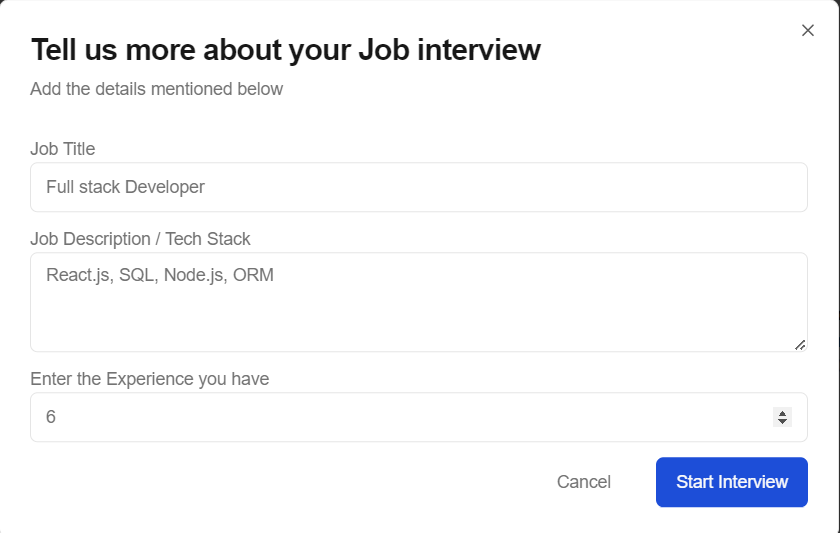
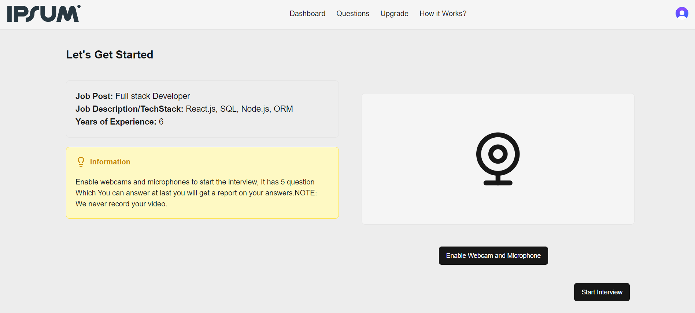
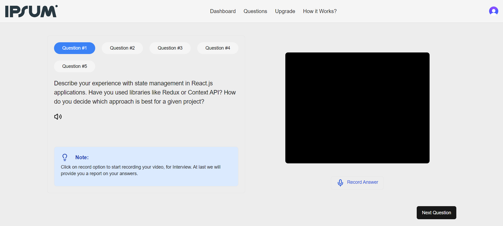
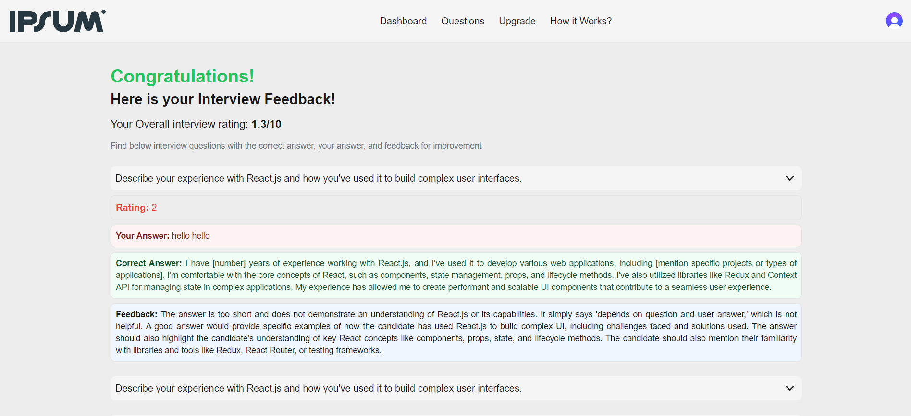

## MockTalk

**AI-Powered Mock Interview Coach**

MockTalk enables you to practice and perfect your interview skills with role-specific, AI-generated questions and real-time feedback. Whether you’re targeting a software engineer, data scientist, or tech lead position, MockTalk tailors each session to your goals and experience level.

---

## 🎯 Core Features

* **Role-Based Question Generator**: Input your desired job title, tech stack, and years of experience to receive highly relevant interview questions.
* **Generative AI Engine**: Powered by Gemini, generate fresh, contextual questions on the fly.
* **Live Performance Feedback**: Get instant ratings and actionable improvement suggestions after each answer.
* **Webcam & Microphone Integration**: Simulate a real interview environment with video and audio recording.
* **Progress Tracking Dashboard**: Monitor your metrics and see your growth over time.

---

## 🛠️ Tech Stack & Integrations

* **Frontend**: Next.js | Tailwind CSS
* **Language**: TypeScript
* **Database**: PostgreSQL (via Drizzle ORM)
* **Authentication**: Clerk
* **AI Provider**: Gemini (OpenAI)
* **Hosting**: Vercel

---

## 🚀 Quickstart

### 1. Prerequisites

* Node.js (v18+) & npm/yarn
* PostgreSQL database (e.g., Neon)
* OpenAI (Gemini) API key
* Clerk API keys
* Code editor (VS Code recommended)

### 2. Clone & Install

```bash
# Clone the repo
git clone https://github.com/your-username/ai-interview-coach.git
cd ai-interview-coach

# Install dependencies
npm install        # or yarn install
```

### 3. Configure Environment

Create a `.env.local` file at the project root and populate with:

```env
NEXT_PUBLIC_CLERK_PUBLISHABLE_KEY=your_clerk_publishable_key
NEXT_PUBLIC_CLERK_SIGN_IN_URL=/sign-in
NEXT_PUBLIC_CLERK_SIGN_UP_URL=/sign-up
NEXT_PUBLIC_GEMINI_API_KEY=your_gemini_api_key
DATABASE_URL=your_postgres_connection_string
NEXT_PUBLIC_INFO_INTRO="Enable webcam & mic to start the interview. We never record your video."
NEXT_PUBLIC_INFO_INSTRUCT="Answer five questions; at the end you’ll receive a detailed report."
```

### 4. Run Locally

```bash
npm run dev  # or yarn dev
```

Open [https://localhost:3000](https://localhost:3000) in your browser to begin.

---

## 📁 Project Structure

```bash
# Root directory
├── app/                   # Next.js pages and routes
├── components/            # Reusable UI components
├── public/                # Static assets (images, icons)
├── lib/                   # Database and helper logic
├── utils/                 # Utility functions (API calls, formatting)
├── components.json        # Component configuration
├── drizzle.config.js      # Drizzle ORM configuration
├── middleware.js          # Custom Next.js middleware
├── postcss.config.mjs     # PostCSS configuration (ESM)
├── jsconfig.json          # JavaScript project configuration
├── .env.local             # Environment variables (not committed)
├── tailwind.config.js     # Tailwind CSS configuration
├── tsconfig.json          # TypeScript configuration
└── package.json           # Dependencies and scripts
```

---

## 📖 Usage Guide

1. **Start a Session**: Enter your job title, tech stack, and experience level.

   

2. **Enable Video & Audio**: Allow access to webcam and microphone.

   

3. **Answer Questions**: Respond to five AI-generated questions in your own words.

   

4. **Review Feedback**: View analysis, scores, and suggestions.

   

---

## ☁️ Deployment

Deploy effortlessly on Vercel:

1. Push your code to GitHub.
2. In the Vercel dashboard, import your repository.
3. Add the same environment variables under Project Settings.
4. Click **Deploy** — Vercel handles the build & hosting.

---

## 🤝 Contributing & Code of Conduct

We welcome contributions! Please follow these steps:

1. Fork the repository.
2. Create a branch: `git checkout -b feature/your-feature`
3. Commit your changes: `git commit -m "Add feature"`
4. Push: `git push origin feature/your-feature`
5. Open a Pull Request.

---

## 👥 Contributors

* [Shivani Reddy](https://github.com/ShivaniReddy7733)
* [Ravula Koushal Sai](https://github.com/koushalsai)

---

*Thank you for choosing MockTalk for your interview preparation!*
